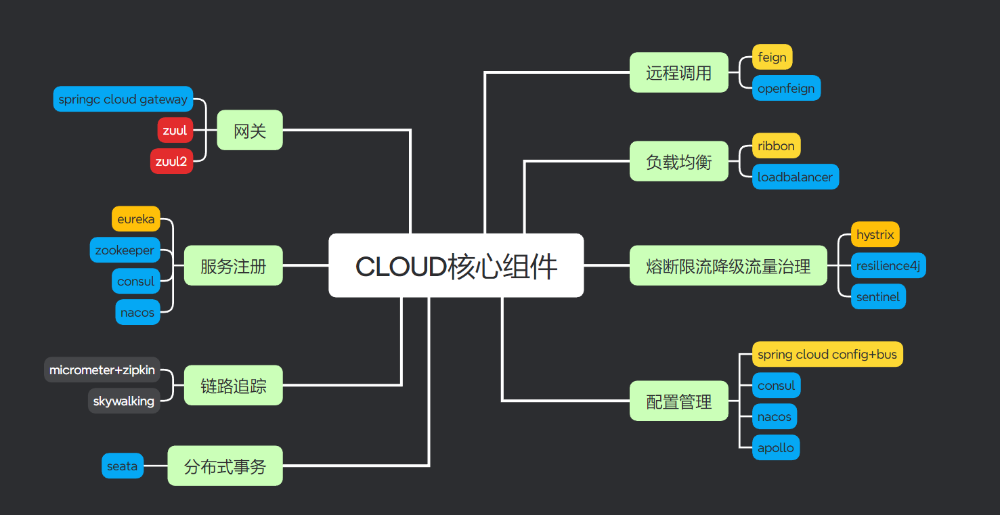

springboot3.X

springcloud 

springcloud alibaba




**versions**


```
<maven.compiler.source>21</maven.compiler.source>
<maven.compiler.target>21</maven.compiler.target>
<project.build.sourceEncoding>UTF-8</project.build.sourceEncoding>
<hutool.version>5.8.22</hutool.version>
<lombok.version>1.18.30</lombok.version>
<druid.version>1.1.20</druid.version>
<mybatis.springboot.version>3.0.2</mybatis.springboot.version>
<mysql.version>8.0.11</mysql.version>
<swagger3.version>2.2.0</swagger3.version>
<mapper.version>4.2.3</mapper.version>
<fastjson2.version>2.0.40</fastjson2.version>
<persistence-api.version>1.0.2</persistence-api.version>
<spring.boot.test.version>3.1.5</spring.boot.test.version>
<spring.boot.version>3.2.0</spring.boot.version>
<spring.cloud.version>2023.0.0</spring.cloud.version>
<spring.cloud.alibaba.version>2023.0.0.0-RC1</spring.cloud.alibaba.version>
<micrometer-tracing.version>1.2.0</micrometer-tracing.version>
<micrometer-observation.version>1.12.0</micrometer-observation.version>
<feign-micrometer.version>12.5</feign-micrometer.version>
<zipkin-reporter-brave.version>2.17.0</zipkin-reporter-brave.version>
```